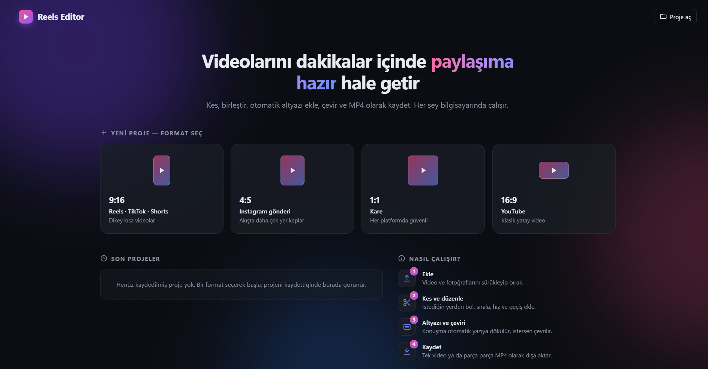
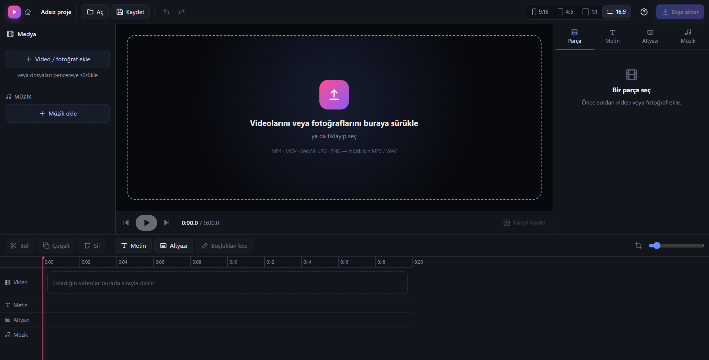
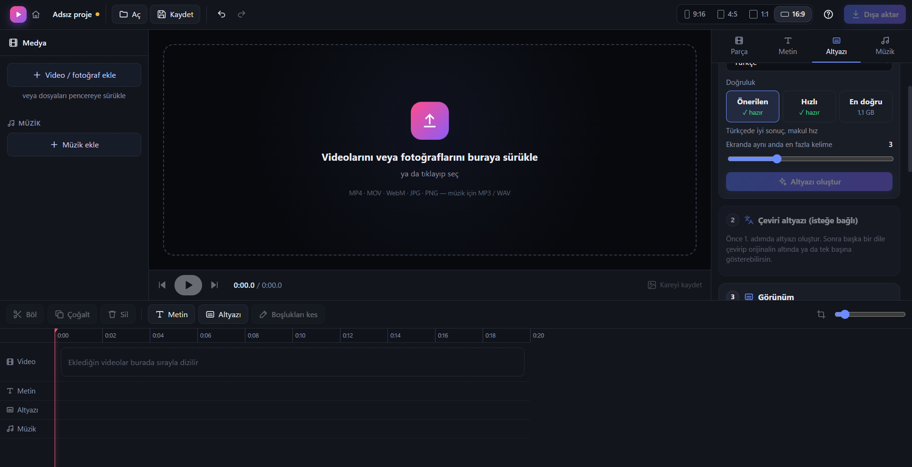

# Reels Editor

Windows için video kırpma, düzenleme ve Reels/TikTok/Shorts oluşturma masaüstü uygulaması.
Electron + React + FFmpeg ile yazılmıştır; her şey bilgisayarınızda çalışır.

## Ekran Görüntüleri

**Karşılama ekranı:** Format seçerek yeni proje (9:16, 4:5, 1:1, 16:9), son projeler ve kısa kullanım rehberi


**Düzenleme ekranı:** Medya paneli, önizleme, zaman çizelgesi (video, metin, altyazı, müzik) ve özellik panelleri


**Otomatik altyazı:** Whisper ile çevrimdışı konuşma tanıma; doğruluk seviyesi seçimi ve çeviri altyazı


## Özellikler

- **Kırpma / kesme:** Zaman çizelgesinde klipleri kenarlarından kırpın, oynatma çubuğundan bölün (S), sürükleyerek sıralayın, silin.
- **Fotoğraf klipleri:** JPG/PNG/WebP fotoğrafları klip olarak ekleyin (varsayılan 3 sn, süresi ayarlanabilir).
- **Hız:** Klip başına 0.25x – 4x (ses perdesi korunur).
- **Geçişler:** Çapraz geçiş, siyaha/beyaza geçiş, kaydırma, silme, daire açılış, yakınlaşma. Klipler arasındaki
  düğmeye tıklayarak ekleyin; önizleme ffmpeg xfade ile birebir aynı formülleri kullanır.
- **Reels formatı:** 9:16, 4:5, 1:1, 16:9. Her klip için *bulanık arka plan*, *siyah kenar* veya *doldur (kırp)*; yakınlaştırma ve kadraj konumu.
- **Metin:** İstediğiniz zaman aralığında metin; yazı tipi, boyut, renk, kontur/kutu/gölge. Önizlemede sürükleyerek konumlandırma.
- **Karşılama ekranı:** Açılış animasyonu, format seçerek yeni proje, son projeler, kısa kullanım rehberi (? tuşu).
- **Otomatik altyazı:** Whisper (yerel, çevrimdışı) ile konuşmayı kelime zamanlarıyla yazıya döker; Reels tarzı kısa satırlara böler, elle düzenlenebilir, SRT olarak kaydedilebilir.
  Üç doğruluk seviyesi (Önerilen: small 8-bit ~250 MB, Hızlı: base ~290 MB, En doğru: large-v3-turbo ~1,1 GB);
  indirme sırasında MB/kalan süre gösterilir ve iptal edilebilir. Müzik/ses efekti üzerine uydurulan satırlar filtrelenir.
- **Çeviri altyazı:** Altyazıları cümle cümle başka bir dile çevirir (Türkçe→İngilizce için ~115 MB OPUS-MT,
  diğer yönler için ~900 MB NLLB-200, 16 dil). Orijinalin altında ikinci satır olarak ya da tek başına gösterilir.
- **Boşlukları otomatik kes:** Konuşmadaki sessiz duraklamaları ffmpeg silencedetect ile bulup çıkarır (3 hassasiyet).
- **Ses dalgası:** Zaman çizelgesindeki parçalarda konuşmanın nerede olduğu görünür.
- **Renk filtreleri:** Canlı, Sinema, Sıcak, Soğuk, Parlak, Soluk, Siyah-beyaz + parlaklık/kontrast/doygunluk/sıcaklık.
  Önizleme (SVG renk matrisi) ve çıktı (ffmpeg colorchannelmixer) aynı matrisi kullanır.
- **Metin şablonları ve animasyonları:** Başlık, vurgu kutusu, etiket, alıntı, daktilo, “Takip et”; belir / büyü / kay / kelime kelime yaz.
- **Hazır altyazı stilleri:** Reels, Büyüyen, Karaoke, Kutulu, Neon, Belirerek, Sade, Sinema; satır giriş animasyonu.
- **Müziği otomatik kıs:** Konuşma sırasında müzik ~11 dB kısılır (sidechain compressor), duraklamalarda geri gelir.
- **Son dokunuşlar:** Başta karardan açılma, sonda kararma, ses seviyesini -14 LUFS'e dengeleme.
- **Kareyi kaydet:** Oynatma çubuğundaki kare tam çözünürlükte PNG (kapak fotoğrafı için).
- **Otomatik kaydetme:** Kaydedilmemiş çalışma 15 sn'de bir yedeklenir; uygulama kapanırsa açılışta geri yüklenebilir.
- **Parçaları ayrı kaydetme:** Dışa aktarırken “Parçaları ayrı ayrı” seçilirse her parça kendi metin, altyazı ve
  müziğiyle ayrı MP4 olur. Parça sekmesinde “Bu parçayı ayrı kaydet” kısayolu var.
- **Kelime kelime vurgu (CapCut tarzı):** Konuşulan kelime renkli, büyüyen, kutulu veya kelime kelime belirerek gösterilir.
- **Müzik / ses:** Arka plan müziği (döngü, başlangıç noktası, sonda otomatik kısılma), klip başına ses seviyesi ve sessize alma.
- Geri al / yinele, proje kaydet / aç, sürükle-bırak ile dosya ekleme.
- Dışa aktarma: H.264 MP4, 30/60 fps, üç kalite seviyesi. Önizleme ile çıktı aynı hesaplamaları kullanır.

## Çalıştırma

Günlük kullanım için masaüstündeki **Reels Editor** kısayolunu kullanın. Kısayol `baslat.vbs` → `baslat.bat`
üzerinden uygulamayı her açılışta kaynak koddan derleyip başlatır; koddaki değişiklikler uygulamayı kapatıp
açınca görünür. Bir hata olursa `baslat.bat` dosyasını çift tıklayarak mesajı görebilirsiniz.

`exe_olustur.bat` başkasına verilebilecek bir kurulum dosyası üretir (kaynak koda bağlı değildir).

```bash
npm install
npm run dev      # geliştirme (canlı yenileme)
npm start        # derleyip çalıştır
npm run dist     # Windows kurulum dosyası → release/ReelsEditor-Kurulum-<sürüm>.exe
```

`npm run dist` sonrası `release/ReelsEditor-Kurulum-0.1.0.exe` kurulum dosyası oluşur (masaüstü ve Başlat menüsü
kısayolu ekler). Kurmadan denemek için `release/win-unpacked/Reels Editor.exe` doğrudan çalıştırılabilir.

## Performans (8 GB RAM / i7 için ayarlı)

- Dışa aktarma: Normal kalitede x264 `veryfast` (medium'a göre 2–3 kat hızlı), Yüksek kalitede `fast`.
- Bulanık arka plan dörtte bir çözünürlükte hesaplanır.
- Tüm metin/altyazılar tek bir şeffaf görüntü akışı olarak bindirilir; yüzlerce altyazı dışa aktarmayı yavaşlatmaz.
- Whisper modeli yalnızca altyazı oluştururken bellekte tutulur, bittiğinde boşaltılır. "Doğru (small)" model
  8-bit yüklenir (~250 MB). 8 GB RAM'de "Dengeli (base)" önerilir.
- Önizleme yarım çözünürlükte çizilir; durdurulmuşken değişiklik yoksa hiç çizilmez.

## Kısayollar

| Tuş | İşlem |
| --- | --- |
| Boşluk | Oynat / duraklat |
| S | Oynatma çubuğundan böl |
| T | Metin ekle |
| Delete | Seçileni sil |
| ← / → | 1 kare geri / ileri (Shift ile 1 sn) |
| Ctrl+Z / Ctrl+Y | Geri al / yinele |
| Ctrl+S | Projeyi kaydet |
| Ctrl + tekerlek | Zaman çizelgesini yakınlaştır |

## Yapı

```
electron/main.mjs       Pencere, dosya diyalogları, media:// protokolü, IPC
electron/ffmpeg.mjs     ffprobe ile analiz, ffmpeg ile dışa aktarma
electron/transcribe.mjs Whisper ile altyazı (@huggingface/transformers)
shared/geom.mjs         Önizleme ve dışa aktarmanın ortak kadraj hesabı
src/player.js           Zaman çizelgesi oynatıcısı (video → canvas)
src/render.js           Kare ve metin çizimi, metinleri PNG'ye dönüştürme
src/store.js            Proje durumu, geri al / yinele
src/components/         Arayüz (ClipTab: kırpma/hız/geçiş/kadraj, SubsTab: altyazı)
```

## Notlar

- Önizleme, Chromium'un oynatabildiği codec'leri gösterir (H.264/MP4, VP9/WebM). HEVC (H.265) gibi
  formatlar önizlemede açılmayabilir ama dışa aktarma FFmpeg ile yine çalışır.
- Altyazı ve çeviri modelleri ilk kullanımda bir kez indirilir (`%APPDATA%/Reels Editor/models`), sonra çevrimdışı çalışır.
